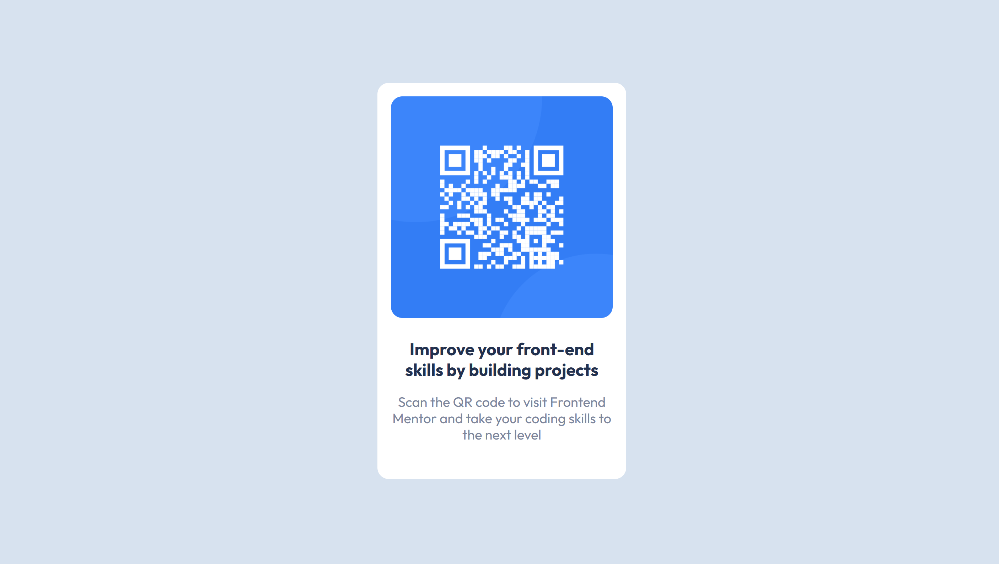

# Frontend Mentor - QR code component solution

This is a solution to the [QR code component challenge on Frontend Mentor](https://www.frontendmentor.io/challenges/qr-code-component-iux_sIO_H). Frontend Mentor challenges help you improve your coding skills by building realistic projects.

## Table of contents

- [Overview](#overview)
  - [Screenshot](#screenshot)
  - [Links](#links)
- [My process](#my-process)
  - [Built with](#built-with)
  - [What I learned](#what-i-learned)
  - [Continued development](#continued-development)
  - [Useful resources](#useful-resources)
- [Author](#author)
- [Acknowledgments](#acknowledgments)

**Note: Delete this note and update the table of contents based on what sections you keep.**

## Overview

The challenge was to design a QR code with given design choices.
I decided to keep it simple and use purely HTML and CSS, with one media query to adapt to mobile devices.

### Screenshot

### Links

- Solution URL: [Add solution URL here](https://github.com/DanCodeCraft/FEM-qrCodeComponent)
- Live Site URL: [Add live site URL here](https://fem-qr-code-component-ebon.vercel.app/)

## My process

- Write the HTML
- Reset the CSS defaults
- Making everything a flexbox container
- Style everything following the given requests in the challenge

### Built with

- Semantic HTML5 markup
- CSS custom properties
- Flexbox
- Mobile-first workflow

### What I learned

I'm a very beginner, with something like 2 weeks of experience in this.
Everything was a challenge, and took me about 1 hour and a half from download to deployment.

### Continued development

My goal is to change my career in my late 30's.
And I chose to be a front end developer.
I'm "mastering" HTML and CSS to jump into JS and React.

## Author

- Website - [LinkedIn](https://www.linkedin.com/in/adannjacinto/)
- Frontend Mentor - [@DanCodeCraft](https://www.frontendmentor.io/profile/DanCodeCraft)
- Twitter - [@DanCodeCraft](https://twitter.com/DanCodeCraft)
